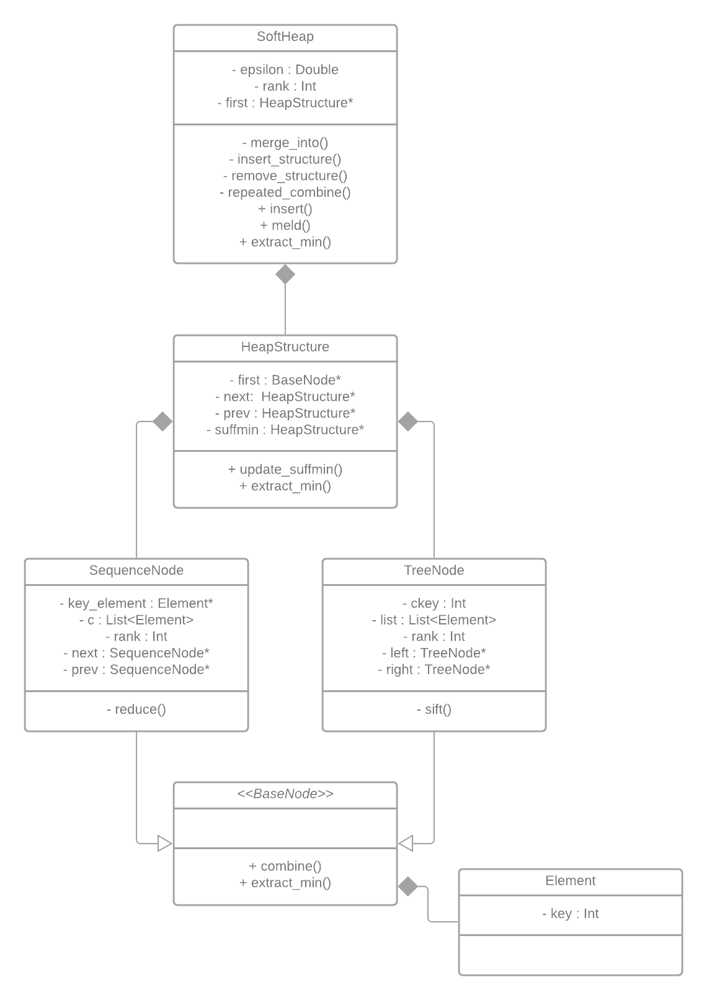

# Soft Heap - Miękki Kopiec

## Opis
Część implementacyjna pracy analizującej różne podejścia miękkich kopców. Przed przystąpieniem do analizy samego kodu zachęcam do przeczytania części teoretycznej w której wyjaśniam zaimplementowane pomysły.

## Jak uruchomić?
1. `git clone https://github.com/dominik1999w/SoftHeap.git`
2. Utwórz domyślny `build` folder (output `cmake`) i wywołaj komendę `cmake` (Linux: ```mkdir cmake-build-debug && cd cmake-build-debug && cmake ..```)
3. Uruchom utworzony Makefile komendą `make`
4. Wywołaj `./[nazwa klasy testowanej]Test` w celu przetestowania klasy
5. Wywołaj `./[nazwa algorytmu]Generator` w celu wygenerowania danych 

## Struktura + UML
Zaimplementowałem dwa warianty miękkich kopców :
1. Kaplan'a i Zwick'a - stosowana jest drzewiasta hierarchia 
2. Brodal'a - stosowane są sekwencje

Dwa niezależne podejścia sprowadziłem do implementacji, które różnią się tylko na poziomie wierzchołka (Node'a). 

Poprawność kodu poparłem testami (pliki z sufiksem `Test`).

Do przetestowania praktycznych zastosowań stworzyłem następujące mechanizmy:
1. klasa `ApproxSortGenerator`, która implementuje algorytm sortowania aproksymacyjnego z użyciem obu wariantów miękkich kopców. Generuje ona trzy rodzaje danych użytych do analizy w części teoretycznej (pliki w folderze `data`: `*_approx_sort_deviation.txt` , `*_approx_sort_inversions_epsilon.txt`, `_approx_sort_time_epsilon.txt`).
2. klasa `KthElementGenerator`, która implementuje algorytm wyboru k-tego co do wielkości elementu z zadanej permutacji. Generuje ona pliki postaci `*_kth_element_time_epsilon.txt`.



